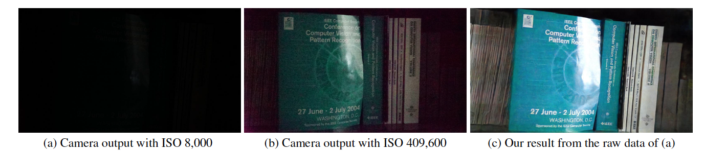

# Learning-to-See-in-the-Dark

This is a Tensorflow implementation of Learning to See in the Dark in CVPR 2018, by [Chen Chen](http://cchen156.github.io/), [Qifeng Chen](http://cqf.io/), [Jia Xu](http://pages.cs.wisc.edu/~jiaxu/), and [Vladlen Koltun](http://vladlen.info/).  

[Paper](http://cchen156.github.io/paper/18CVPR_SID.pdf)<br/>



This code includes the default model for training and testing on the See-in-the-Dark (SID) dataset. 


## Setup

### Requirement
Required python (version 2.7) libraries: Tensorflow (>=1.1) + Scipy + Numpy + Rawpy.

Tested in Ubuntu + Intel i7 CPU + Nvidia Titan X (Pascal) with Cuda (>=8.0) and CuDNN (>=5.0). CPU mode should also work with minor changes but not tested.

### Dataset


You can download it directly from Google drive for the [Sony](https://storage.googleapis.com/isl-datasets/SID/Sony.zip) (25 GB)  and [Fuji](https://storage.googleapis.com/isl-datasets/SID/Fuji.zip) (52 GB) sets. 

There is download limit by Google drive in a fixed period of time. If you cannot download because of this, try these links: [Sony](https://drive.google.com/open?id=1G6VruemZtpOyHjOC5N8Ww3ftVXOydSXx) (25 GB)  and [Fuji](https://drive.google.com/open?id=1C7GeZ3Y23k1B8reRL79SqnZbRBc4uizH) (52 GB).

New: we provide file parts in [Baidu Drive](https://pan.baidu.com/s/1fk8EibhBe_M1qG0ax9LQZA) now. After you download all the parts, you can combine them together by running: "cat SonyPart* > Sony.zip" and "cat FujiPart* > Fuji.zip".


The file lists are provided. In each row, there are a short-exposed image path, the corresponding long-exposed image path, camera ISO and F number. Note that multiple short-exposed images may correspond to the same long-exposed image. 

The file name contains the image information. For example, in "10019_00_0.033s.RAF", the first digit "1" means it is from the test set ("0" for training set and "2" for validation set); "0019" is the image ID; the following "00" is the number in the sequence/burst; "0.033s" is the exposure time 1/30 seconds.  


### Testing
1. Clone this repository.
2. Download the pretrained models by running
```Shell
python download_models.py
```
3. Run "python test_Sony.py". This will generate results on the Sony test set.
4. Run "python test_Fuji.py". This will generate results on the Fuji test set.

By default, the code takes the data in the "./dataset/Sony/" folder and "./dataset/Fuji/". If you save the dataset in other folders, please change the "input_dir" and "gt_dir" at the beginning of the code. 

### Training new models
1. To train the Sony model, run "python train_Sony.py". The result and model will be save in "result_Sony" folder by default. 
2. To train the Fuji model, run "python train_Fuji.py". The result and model will be save in "result_Fuji" folder by default. 

By default, the code takes the data in the "./dataset/Sony/" folder and "./dataset/Fuji/". If you save the dataset in other folders, please change the "input_dir" and "gt_dir" at the beginning of the code.

Loading the raw data and proccesing by Rawpy takes significant more time than the backpropagation. By default, the code will load all the groundtruth data processed by Rawpy into memory without 8-bit or 16-bit quantization. This requires at least 64 GB RAM for training the Sony model and 128 GB RAM for the Fuji model. If you need to train it on a machine with less RAM, you may need to revise the code and use the groundtruth data on the disk. We provide the 16-bit groundtruth images processed by Rawpy: [Sony](https://drive.google.com/file/d/1wfkWVkauAsGvXtDJWX0IFDuDl5ozz2PM/view?usp=sharing) (12 GB)  and [Fuji](https://drive.google.com/file/d/1nJM0xYVnzmOZNacBRKebiXA4mBmiTjte/view?usp=sharing) (22 GB). 


## Citation
If you use dataset for research, please cite their paper:

Chen Chen, Qifeng Chen, Jia Xu, and Vladlen Koltun, "Learning to See in the Dark", in CVPR, 2018.

### License
MIT License.


